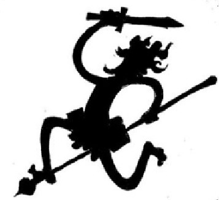

  <!-- knock code pictures 敲代码的图片 -->
  <picture>
    <source media="(prefers-color-scheme: dark)" srcset="https://cdn.jsdelivr.net/gh/sun0225SUN/sun0225SUN/assets/images/coding.gif" />
    <source media="(prefers-color-scheme: light)" srcset="figure/face.jpg" height="225px" />
    
  </picture>

  <!-- for beauty 留个空行好看点 -->
  
&nbsp;

<!-- profile logo 个人资料徽标 -->
  <!-- 

    &emsp;
    &emsp;
  
 -->

<!-- Snake Code Contribution Map 贪吃蛇代码贡献图 -->
<picture>
  <source media="(prefers-color-scheme: dark)" srcset="https://raw.githubusercontent.com/KAP424/KAP424/output/github-contribution-grid-snake-dark.svg">
  <source media="(prefers-color-scheme: light)" srcset="https://raw.githubusercontent.com/KAP424/KAP424/output/github-contribution-grid-snake.svg">
  
</picture>

#  🙋 Hello

<table>

<tr><td>

### 🤺 About Me

&emsp;&emsp;嗨，我是申昌裕。热爱物理、编程、健身、骑行。

&emsp;&emsp;想要顺利PhD毕业，实现不被异化的自我劳动价值，自由也许无法抵达，但不妨碍我不断靠近。

<!-- 
&emsp;&emsp; 个人公众号：<a href="https://github.com/KAP424/vuepressblog/blob/master/images/QR-Code.png" target="_blank"> PeterJXL </a>
 -->

&emsp;&emsp;-- 我们正在让这个世界变得更加美好，尼卡将会带来快乐消逝痛苦。

&emsp;&emsp;<strong>-- We're making the world a better place. Nika will bring happiness and alleviate pain.</strong>

  <!-- for beauty 留个空行好看点 -->
  
&nbsp;

</td></tr>

<tr><td>

## 🏢 Education Experience

- [兰州大学](https://www.lzu.edu.cn/) &emsp; 📌 2020-07 —— 2024-07

  - 学习经历：于萃英学院理论物理专业获取本科学位

- [中国科学院物理研究所](https://theory.iphy.ac.cn/team06.html)   📌 2024-09 —— right now

  - 所读部门：凝聚态强关联理论（T06）
  - 工作内容：参与量子蒙特卡洛算法开发
  - 导师：[李自翔](https://iop.cas.cn/rcjy/tpyjy/?id=4443)

  <!-- for beauty 留个空行好看点 -->
  
&nbsp;

</td></tr>

<tr><td>

## 📕Papers

> [关于增量算法的粗浅理解](https://zhuanlan.zhihu.com/p/1900545191137490676)
>
> [Universal Entanglement Growth along Imaginary Time in Quantum Critical Systems](https://arxiv.org/pdf/2512.23361)

</td></tr>

</table>

<!-- ## 📊 GitHub 数据统计 -->

<!-- metrics 基础资料 -->
<!--  -->

<!-- GitHub 数据统计 -->

<!--   -->

<!--  -->

<!-- github-readme-streak-stats 连续提交代码天数记录 -->
<!-- <picture>
  <source media="(prefers-color-scheme: light)" srcset="https://streak-stats.demolab.com/?user=KAP424&theme=light&hide_border=true" />
  
</picture>

<!-- GitHub Activity Graph GitHub 活动图 -->
<!-- <table>
  <tr>
    <td>
      <picture>
        <source media="(prefers-color-scheme: dark)"  srcset="https://github-readme-activity-graph.vercel.app/graph?username=KAP424&theme=tokyo-night" />
        <source media="(prefers-color-scheme: light)" srcset="https://github-readme-activity-graph.vercel.app/graph?username=KAP424&theme=xcode" />
        
      </picture>
  </tr>
</table> -->

<!-- profile-3d-contrib 3D 贡献图-->
<!-- <picture>
  <source media="(prefers-color-scheme: dark)" srcset="/profile-3d-contrib/profile-night-rainbow.svg" />
  <source media="(prefers-color-scheme: light)" srcset="/profile-3d-contrib/profile-gitblock.svg" />
  
</picture>

